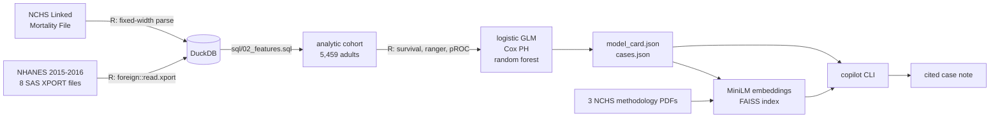
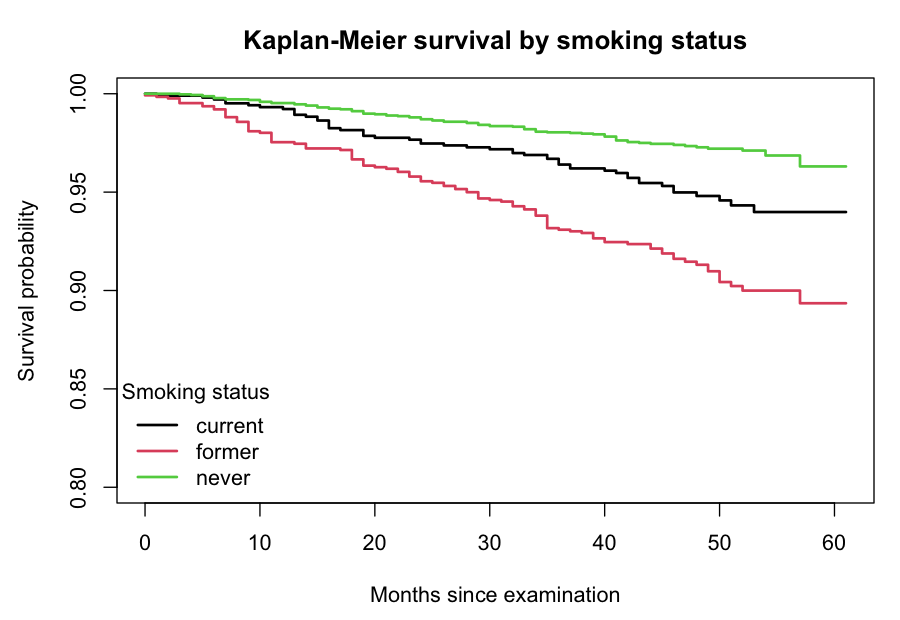
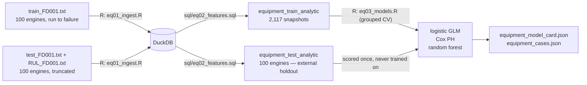

# mortality-copilot

Survival analysis of public U.S. health-survey data in **R** and **SQL**, wrapped in
a local, fully open-source **RAG copilot** that writes an explainable, source-cited
risk note for an individual case.

> ### This is not an underwriting system
> An educational project built on a public general-population health survey. It is
> not a mortality table, it has never seen an insurance policy, and it must not be
> used for any real insurance, medical or financial decision. The limitations
> section below is not boilerplate — please read it.

Everything runs locally. No paid APIs, no accounts, no API keys, no GPU. The demo
works with no language model installed.

---

## What it does

```
$ make demo

╭──────────────────────────────────────────────────────────────────────────────╮
│ Estimated risk: 25.05%   ·   decile 10/10   ·   prediction is out-of-fold    │
╰──────────────────────────────────────────────────────────────────────────────╯
                 case_044 — modelled 36-month mortality risk
┏━━━━━━━━━━━━━━━━━━━━━━━━━━━━━━━━┳━━━━━━━━━━━━━━━━━━━━━━━━━┳━━━━━━━━━━━━━━━━┓
┃ Driver                         ┃ Contribution (log-odds) ┃ Direction      ┃
┡━━━━━━━━━━━━━━━━━━━━━━━━━━━━━━━━╇━━━━━━━━━━━━━━━━━━━━━━━━━╇━━━━━━━━━━━━━━━━┩
│ Age = 74                       │                  +1.873 │ increases risk │
│ Income-to-poverty ratio = 0.53 │                  +0.536 │ increases risk │
│ Smoking status = current       │                  +0.396 │ increases risk │
│ Sex = male                     │                  +0.366 │ increases risk │
│ Education = lt 9th             │                  +0.227 │ increases risk │
└────────────────────────────────┴─────────────────────────┴────────────────┘
╭───────────────────── Case note — deterministic fallback ─────────────────────╮
│ The model estimates a 25.0% probability of death within 36 months of         │
│ examination for case_044, placing it in risk decile 10 of 10 for this        │
│ cohort. Characteristics pushing the estimate up, relative to the cohort      │
│ average, are Age = 74, Income-to-poverty ratio = 0.53, Smoking status =      │
│ current, Sex = male and Education = lt 9th. On the limitations of the        │
│ underlying data: Due to the probabilistic nature of the linkage, those that  │
│ linked to the NDI are assumed deceased and those that did not are assumed    │
│ alive. [source: linked-mortality-file-description.pdf, page 1]               │
╰──────────────────────────────────────────────────────────────────────────────╯
```

Every number in the driver table is an exact decomposition of the model's
log-odds. Every claim taken from a document carries the page it came from.

You can also query the corpus directly:

```bash
python -m pipeline.copilot --ask "why might mortality be underestimated here?"
```

## Architecture



R owns every statistic. SQL owns the feature engineering. Python owns the data
plumbing and the retrieval layer.

## Quickstart

Requires R 4.x and Python 3.11. Measured on an Apple Silicon laptop, no GPU.

```bash
git clone https://github.com/williamhuang1261/mortality-copilot
cd mortality-copilot

make setup      # venv + 3 CRAN packages          ~30 s (ranger compiles, 19 s)
make data       # download CDC data -> DuckDB     ~30 s first run (21 MB), 1 s cached
make features   # build the cohort in SQL         <1 s
make eda        # hypothesis tests + figures      ~6 s
make models     # fit and validate, export JSON   ~4 s
make setup-rag  # torch + faiss                   download-bound, +1.2 GB on disk
make index      # embed the corpus                ~7 s
make demo       # explain one case                ~5 s
make finetune   # optional: tune the retriever    ~19 s
```

`make all` runs data → features → eda → models. The statistical half of the project
needs neither `setup-rag` nor a language model.

## Data

All inputs are U.S. public domain and need no registration. Verified 2026-08-23.

| Dataset | Contents | URL |
| --- | --- | --- |
| NHANES 2015-2016 | `DEMO_I` demographics, `BMX_I` body measures, `BPX_I` blood pressure, `SMQ_I` smoking, `DIQ_I` diabetes, `MCQ_I` medical conditions, `HDL_I` cholesterol, `GHB_I` HbA1c | [wwwn.cdc.gov/Nchs/Data/Nhanes/Public/2015/DataFiles](https://wwwn.cdc.gov/Nchs/Data/Nhanes/Public/2015/DataFiles/) |
| NCHS Public-Use Linked Mortality File | Mortality status and follow-up time through 2019 | [ftp.cdc.gov/…/linked_mortality](https://ftp.cdc.gov/pub/HEALTH_STATISTICS/NCHS/datalinkage/linked_mortality/) |
| NCHS methodology PDFs (×3) | File description, data dictionary, analytic considerations — the retrieval corpus | [cdc.gov/nchs/data-linkage/mortality-public.htm](https://www.cdc.gov/nchs/data-linkage/mortality-public.htm) |

Two traps worth knowing about, both handled in `R/01_ingest.R`:

- The widely-cited URL form `wwwn.cdc.gov/Nchs/Nhanes/2015-2016/DEMO_I.XPT` now
  returns the CDC homepage as **HTML with HTTP 200**. Parsed blindly it yields an
  empty table rather than an error, so every download is checked for the SAS XPORT
  magic bytes.
- The mortality file is fixed-width ASCII with no header. Column positions come
  from the official NCHS read-in program and are pinned by a test — a misaligned
  width parses to plausible-looking garbage.

## Cohort

Every exclusion is counted. Silent row loss is how cohort studies go wrong.

| Step | n |
| --- | ---: |
| NHANES 2015-2016 participants | 9,971 |
| Eligible for mortality follow-up | 5,974 |
| … aged 20 or over | 5,701 |
| … examined, not interview-only | **5,459** |
| … complete predictors, labelled endpoint, no `unknown` category | **4,906** |

4,906 adults, 151 deaths within 36 months (3.1%), 204 deaths over all follow-up.

### Why the endpoint is 3 years, not 5

The obvious target is 5-year mortality. The data cannot support it. Follow-up ends
in 2019, so survivors have a **median of 47 months** observed and only 99 of 5,426
reach 60 months. Compare the candidate horizons:

| Endpoint | Usable | Dropped | Apparent event rate |
| --- | ---: | ---: | ---: |
| 36 months | 5,387 | 9 (0%) | 3.47% |
| 48 months | 2,884 | 2,558 (47%) | 8.08% |
| 60 months | 349 | 5,110 (94%) | **71.63%** |

A 5-year model would have looked like it worked while measuring censoring rather
than mortality. The Cox model still uses the full censored data; only the binary
classifiers are re-based to 36 months.

## Methodology

**Feature engineering** lives in `sql/02_features.sql` so the joins, the NHANES
value codings and the missingness handling are reviewable in one file. NHANES codes
7 as "Refused" and 9 as "Don't know"; both become an explicit `unknown` category,
never a real value. A diastolic reading of 0 means no sound was detected, not a
blood pressure of zero, and is nulled before averaging.

**Exploratory analysis** (`docs/eda.md`) reports no bare point estimates. Every
comparison carries a confidence interval and a p-value, Holm-adjusted across all
fifteen tests. Strongest crude associations: prior cancer (χ²=148.6), prior heart
disease (χ²=103.8), smoking (χ²=77.4), diabetes (χ²=68.2). Mean age differs by
**+21.93 years [+20.41, +23.46]** between those who died and those who did not.
BMI (p=0.55) and HDL (p=0.99) show nothing.

Crude smoking mortality *inverts* — former smokers die more than current smokers —
because people quit as they age and fall ill. Mean age is 57.3 for former smokers
against 46.6 for current. The report says so rather than leaving a reader to assume
a bug.

**Three models** on identical seeded folds: a logistic GLM as the interpretable
reference, a Cox proportional-hazards model that uses the censored survival time
instead of a binary label, and a random forest as a flexible benchmark.

**Data decisions**, each forced by measurement rather than preference:

- `waist` dropped — it correlates 0.910 with BMI, and requiring it complete cost
  161 rows and 23 deaths.
- `income_ratio` median-imputed with an explicit `income_missing` indicator; it is a
  strong predictor and 10.3% missing, and non-response on income is plausibly
  informative.
- 42 rows carrying an `unknown` category excluded **from modelling only**. Three of
  those categories contain zero deaths, which is complete separation: the Cox fit
  returned infinite coefficients.

## Results

Out-of-fold, 5-fold cross-validation stratified on the outcome, seed 20260823.

| Model | AUC | 95% CI (DeLong) | Brier | Calibration slope |
| --- | ---: | :---: | ---: | ---: |
| Cox proportional hazards | **0.856** | [0.828, 0.884] | 0.0277 | 0.851 |
| Logistic GLM | 0.853 | [0.824, 0.881] | 0.0276 | 0.848 |
| Random forest | 0.841 | [0.806, 0.876] | 0.0274 | 0.827 |

Cox concordance over the full censored data: **0.873** (SE 0.011).

Three results worth stating plainly because they are not flattering:

1. **The random forest loses to the logistic GLM.** The flexible model does not win
   here. With 151 events and mostly monotone predictors, there is little
   non-linearity to find.
2. **The lab panel does not earn its place.** Adding HDL and HbA1c to demographics
   plus clinical history gives χ²=3.00 on 2 df, **p=0.22**. Clinical history over
   demographics alone does (χ²=22.34, 9 df, p=0.0079).
3. **Calibration slopes sit near 0.85**, so predictions are somewhat too extreme.
   The ranking is good; the absolute probabilities need shrinkage.

`cox.zph` finds one violation of proportional hazards — systolic blood pressure
(p=0.028), against a global p of 0.51. Its hazard ratio is therefore an average
over follow-up, not a constant effect. Reported rather than quietly dropped.



### scikit-learn cross-check

The same cohort and predictor set, refit in Python (`make sklearn-baseline`)
on an independently-drawn stratified 5-fold split, not R's own fold
assignment, since the two RNGs cannot be made to match:

| Model | AUC | Brier |
| --- | ---: | ---: |
| Logistic Regression (scikit-learn) | 0.855 | 0.02749 |
| Random Forest (scikit-learn) | 0.843 | 0.02751 |

Both land within 0.002 AUC of their R counterparts (GLM 0.853, RF 0.841)
despite the independent folds, and the cohort size matches exactly (4,906
rows, 151 deaths), confirming the exclusion rule was ported correctly. Full
comparison and methodology: [`docs/sklearn_baseline.md`](docs/sklearn_baseline.md).

## Retrieval

75 chunks from three NCHS PDFs plus the generated model card, embedded with
`all-MiniLM-L6-v2` and served from a FAISS index. Each chunk keeps its source file
and page, so a citation can be checked.

| Metric | Base | Fine-tuned | Delta |
| --- | ---: | ---: | ---: |
| recall@5 | 0.815 | 0.796 | −0.019 |
| MRR | 0.655 | 0.707 | +0.052 |

Mixed, so **the fine-tuned weights are not adopted** and the copilot continues to
use the base model. Full method and reasoning in [`docs/retrieval_eval.md`](docs/retrieval_eval.md).
This fine-tunes a bi-encoder for retrieval — it is not instruction-tuning and not
LoRA on a generative model.

## Agentic tool-use mode

`pipeline/copilot.py` is single-shot: one case in, one cited note out, no
memory between runs. `python -m pipeline.agent` is a multi-turn session on
top of the same artifacts, built around three tools instead of one retrieval
call:

| Tool | Does |
| --- | --- |
| `lookup_case_by_number` | returns a case's predicted risk, decile and top drivers |
| `query_model_card` | keyword-matches a question against the model card's own JSON sections (cohort, validation, limitations, coefficients, ...) and returns them verbatim |
| `what_if` | recomputes a case's risk with one feature changed, using the fitted GLM's own coefficient for that term |

Two dispatch paths, same fail-closed shape as `copilot.py`'s Ollama-or-fallback
split:

- **Deterministic dispatcher (default).** A small regex/keyword parser maps
  an utterance to a tool call. This is what the test suite exercises — no
  Ollama required, so CI covers the whole tool-use path.
- **`--llm` (opt-in).** Sends the tool schemas and the running conversation to
  a local Ollama model via its `tools=[...]` chat parameter; the model's tool
  call is executed and the result fed back for a final reply. Any failure — no
  Ollama installed, a malformed call, an unknown tool name — falls back to the
  deterministic dispatcher for that turn. Not installed on this machine, so
  (like the rest of this project's Ollama path) it is the fallback that gets
  verified, not the model-driven call itself.

Session memory is a single `Session` object holding the last case discussed,
so a follow-up does not need to repeat the case id:

```
$ make agent-demo
> case 1
[deterministic dispatcher] case_001: predicted 36-month risk 4.63%, decile 9/10.
Top drivers: Age = 67, Diabetes = yes, Sex = male.

> what if age were 80
[deterministic dispatcher] Case case_001: changing age from 67 to 80.0 moves the
predicted 36-month risk from 4.63% to 11.58% (+6.95 points), recomputed from the
fitted GLM's own coefficient for age (+0.9924 log-odds). This is relative to the
case's original modelled risk, not a chained previous what-if.

> now raise hba1c by 20%
[deterministic dispatcher] Case case_001: changing hba1c from 8.6 to
10.32 moves the predicted 36-month risk from 4.63% to 4.64% (+0.01 points),
recomputed from the fitted GLM's own coefficient for hba1c (+0.0020 log-odds).

> how many people are in the cohort?
[deterministic dispatcher] {
  "cohort": {
    "n": 4906,
    "deaths_36_months": 151,
    "event_rate_36_months": 0.03078
    ...
  }
}
```

Note the second and third turns never repeat `case_001` — the session
remembers it from the first turn.

**Why `what_if` is scoped to twelve features, not all fifteen the model
uses.** The fitted GLM has terms for `race_eth` and `education`, but
`artifacts/cases.json`'s per-case export never carried those two fields, only
the twelve others. For the seven continuous terms (age, bmi, sbp, dbp, hdl,
hba1c, income_ratio), moving one by `delta` changes the log-odds by exactly
`coefficient * delta` — a GLM is linear in log-odds for a continuous term
regardless of what else is held fixed, so this is a real re-application of
the fitted model, not an approximation. The five categorical terms with a
per-case counterpart (smoker, diabetes, sex, prior_chd, prior_cancer) work
the same way: swap the old dummy coefficient out, the new one in.
`race_eth`/`education` are refused with an explicit message rather than
silently ignored — `pipeline/tools.py`'s `OUT_OF_SCOPE_FEATURES`.

### Agent evaluation harness

`tests/test_agent.py` checks individual dispatcher calls in isolation.
`pipeline/agent_eval.py` sits a level above that: it scores the agent against
**6 golden multi-turn conversations (15 turns)** covering explicit case
lookup, percentage/absolute/categorical what-ifs, model-card questions,
mid-conversation case switching, and the two fail-closed error paths (no
case in context, an unparseable change direction). Each what-if turn is
checked two ways against a value pinned once from `artifacts/model_card.json`'s
own fitted coefficients: that `parse_utterance` selects the `what_if` tool,
and that `dispatch`'s natural-language reply surfaces the exact same rounded
risk percentage a direct `tools.what_if` call produces — catching a
formatting drift the existing substring-only tests would miss.

```
$ make agent-eval
agent eval: 6/6 scenarios, 15/15 turns, accuracy 100.0%
  [PASS] explicit_case_then_absolute_what_if
  [PASS] percentage_what_if_and_limitations_query
  [PASS] categorical_what_if_and_cohort_query
  [PASS] case_switch_mid_conversation_uses_latest_context
  [PASS] what_if_without_case_in_context_fails_closed
  [PASS] unparseable_change_direction_fails_closed
```

The harness writes `artifacts/agent_eval_report.json` and exits non-zero
on any regression, so it can gate CI the same way the other golden-run
tests in this repo do. `tests/test_agent_eval.py` pins the scenario/turn
counts and the 100% accuracy figure above against the real, committed
artifacts — not a fixture.

## Second domain: equipment health scoring (predictive maintenance)

The same survival-analysis pipeline, applied to a second dataset in a different
physical domain: NASA's public **C-MAPSS FD001** turbofan engine degradation
data, instead of a human health survey. The output is an **asset health score**
and a **remaining-useful-life** estimate — multivariate sensor telemetry in,
instead of a health survey.



### Data

NASA Prognostics Center of Excellence C-MAPSS dataset, FD001 subset (single
operating condition, one fault mode), U.S. public domain. Fetched from
[github.com/edwardzjl/CMAPSSData](https://github.com/edwardzjl/CMAPSSData)
since the original `ti.arc.nasa.gov` host is defunct.

| File | Contents |
| --- | --- |
| `train_FD001.txt` | 100 engines run to failure, 20,631 rows |
| `test_FD001.txt` | 100 different engines, truncated before failure, 13,096 rows |
| `RUL_FD001.txt` | True remaining life at each test engine's truncation point |

### What plays the role of what

| Mortality domain | Equipment domain |
| --- | --- |
| One NHANES exam per participant | Sensor snapshot every 10 cycles per engine |
| 36-month binary mortality endpoint | 30-cycle binary "fails soon" endpoint (`event_30`) |
| Censored time-to-death for Cox | Uncensored remaining-useful-life (every training engine runs to failure) |
| Stratified 5-fold CV **on rows** | Stratified 5-fold CV **grouped by engine** (a row-level split would leak one engine's trajectory across folds) |
| No true external holdout | `test_FD001` + `RUL_FD001`: 100 engines never seen in any fold or the full-data fit |

### Results

Out-of-fold, 5-fold grouped cross-validation, seed 20260829:

| Model | AUC | 95% CI (DeLong) | Brier | Calibration slope |
| --- | ---: | :---: | ---: | ---: |
| Logistic GLM | **0.987** | [0.983, 0.991] | 0.02935 | 0.837 |
| Random forest | **0.987** | [0.983, 0.991] | 0.03101 | 1.098 |
| Cox proportional hazards | 0.977 | [0.972, 0.983] | 0.04286 | 1.598 |

External holdout — 100 engines never seen in training:

| Model | AUC | 95% CI (DeLong) | Brier |
| --- | ---: | :---: | ---: |
| Random forest | **0.982** | [0.960, 1.000] | 0.05932 |
| Logistic GLM | 0.972 | [0.945, 0.998] | 0.07056 |
| Cox proportional hazards | 0.958 | [0.917, 1.000] | 0.08358 |

Cox concordance on training data: 0.817 (SE 0.004).

Two findings worth stating plainly, because this domain does not behave like
the mortality domain:

1. **`cox.zph` finds proportional-hazards violations in 25 of 28 predictors**
   (against just one in the mortality model). FD001's sensor trajectories are
   monotonic degradation curves — a structurally poor fit for Cox's
   constant-hazard-ratio assumption. Cox PH is kept as a documented
   cross-check here, not the reference model.
2. **The GLM shows quasi-complete separation** — `max(abs(coef))` is 145,319
   and several confidence intervals span hundreds of thousands. FD001's
   simulated degradation is easy to separate given 30 continuous predictors.
   AUC/ranking are unaffected; the coefficient table is not a reliable
   effect-size estimate the way the mortality model's GLM is.

Full methodology, the complete results table, and the stated limitations:
[`docs/equipment.md`](docs/equipment.md).

## Why explainability was built in first

A mortality model that cannot say *why* is useless to the person who has to act on
it, and unacceptable to anyone who has to sign off on it. So the reference model is
a logistic GLM, not because it scores best but because its log-odds is a sum of
per-term contributions:

```
contribution_j = beta_j * (x_ij - mean(x_j))
```

Centring each design column on its cohort mean gives an **exact** additive
attribution — not SHAP, not an approximation. `R/05_export.R` asserts that the
contributions reconstruct the linear predictor to within 1e-8 rather than assuming
it (observed max error: 5.3e-15).

Two things this got wrong first, both now pinned by tests:

- Drivers were labelled by design-matrix column, so a **female** participant showed
  a `"Sex: male"` driver with a negative contribution. Factor dummies are now summed
  back into their source variable and reported with the participant's own value.
- An **imputed** income was presented as though measured. Imputed values are now
  flagged everywhere they surface.

Both are the kind of defect that makes a confident, cited, wrong statement — which
is worse than no explanation at all.

## Engineering notes

**Split requirements.** `requirements.txt` is the core pipeline; `requirements-rag.txt`
holds torch and faiss behind `make setup-rag`. Everything through model fitting runs
without torch: the core virtualenv is 99 MB against 1.3 GB with the retrieval
stack installed, and CI installs only the core set. The cost is a second
setup step for the retrieval half — worth it, because a reviewer who only wants to
read the statistics never pays for the ML stack.

**DuckDB driven from Python, not R.** The R `duckdb` package compiles a large C++
amalgamation and adds roughly twenty minutes to a clean setup; the Python wheel is
prebuilt. R keeps what it is actually better at — SAS XPORT, fixed-width parsing,
and every statistic in the project.

**A deterministic fallback for the copilot.** Generation prefers a local Ollama
model, but a clean clone has none. Rather than fail, the copilot assembles the same
facts with the same citations by template. The demo always runs, and the citation
discipline is testable without a model in the loop.

**No ggplot2, no Quarto.** Base graphics and generated markdown. Two fewer
dependency trees to install and to justify.

**The package is `pipeline/`, not `py/`.** A top-level `py` package shadows the `py`
library that pytest imports internally, which breaks the entire suite the moment the
repository root is on `sys.path`.

**`evaluate()` is duplicated in `R/eq03_models.R`, not extracted into a shared
module.** The equipment extension needed the same AUC/Brier/calibration
report as `R/04_models.R`, but sharing the function would mean editing
`04_models.R` to source it — and this extension's whole guarantee is that the
mortality pipeline is untouched, so its committed AUC 0.856 cannot move. ~15
duplicated lines is a small price for that guarantee holding by construction
rather than by discipline.

**Cross-validation is grouped by engine, not stratified by row.** The
mortality model's folds are row-level because each row is one independent
person. Here, one row is one snapshot of one engine's degradation
trajectory, and adjacent snapshots are highly correlated — a random
row-level split would let one engine's own history leak across train and
test folds. `R/eq03_models.R` asserts (`stopifnot`) that no engine's
snapshots ever span two folds, rather than trusting the sampling to get it
right.

## Limitations

- **Survey weights are not applied.** NHANES uses a complex multistage design.
  Every number here describes this sample of examined adults, **not** the U.S.
  population.
- **NHANES is not an insured population.** It is a general-population health survey.
  There is no policy, premium, lapse, persistency or claims data anywhere in this
  project, and underwritten lives differ systematically from the general public.
- **Deaths are ascertained probabilistically.** Records that link to the National
  Death Index are assumed deceased; those that do not are assumed alive.
- **Several predictors are self-reported** — smoking, diabetes, prior heart disease
  and prior cancer are what participants said, not what a clinician verified.
- **Competing risks are ignored.** The outcome is all-cause mortality.
- **Follow-up is short** (median 47 months), so this speaks only to near-term
  mortality.
- **Predictions are over-dispersed** (calibration slope ≈0.85).
- **The 42 excluded `unknown` rows are not missing at random**, and excluding them
  is a modelling convenience, not a neutral act.

(For the equipment health-score domain's limitations — simulated data, single
operating condition, quasi-complete separation, and more — see
[`docs/equipment.md`](docs/equipment.md).)

## Layout

```
R/           ingest, EDA, models, export        — every statistic (eq0N_*.R — equipment domain)
sql/         the analytic cohort                — feature engineering (eq02_features.sql — equipment domain)
pipeline/    DuckDB loading, indexing, the CLI  — plumbing and retrieval (eq_*.py — equipment domain)
prompts/     the case-note prompt template      — versioned, not inlined
artifacts/   model_card.json, cases.json        — committed, readable without running anything
                                                   (equipment_model_card.json, equipment_cases.json — equipment domain)
docs/        eda.md, retrieval_eval.md, figs/   — committed results (equipment.md — equipment domain)
tests/       no network, no LLM, no R           — what CI runs
```

## Licence

MIT — see [LICENSE](LICENSE). NHANES and NCHS data are U.S. public domain.
