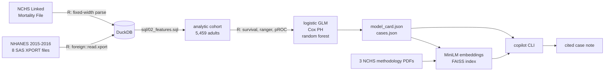

# mortality-copilot

Survival analysis of public U.S. health-survey data in **R** and **SQL**, wrapped in
a local, fully open-source **RAG copilot** that writes an explainable, source-cited
risk note for an individual case.

> ### This is not an underwriting system
> An educational project built on a public general-population health survey. It is
> not a mortality table, it has never seen an insurance policy, and it must not be
> used for any real insurance, medical or financial decision. The limitations
> section below is not boilerplate — please read it.

Everything runs locally. No paid APIs, no accounts, no API keys, no GPU. The demo
works with no language model installed.

---

## What it does

```
$ make demo

╭──────────────────────────────────────────────────────────────────────────────╮
│ Estimated risk: 25.05%   ·   decile 10/10   ·   prediction is out-of-fold    │
╰──────────────────────────────────────────────────────────────────────────────╯
                 case_044 — modelled 36-month mortality risk
┏━━━━━━━━━━━━━━━━━━━━━━━━━━━━━━━━┳━━━━━━━━━━━━━━━━━━━━━━━━━┳━━━━━━━━━━━━━━━━┓
┃ Driver                         ┃ Contribution (log-odds) ┃ Direction      ┃
┡━━━━━━━━━━━━━━━━━━━━━━━━━━━━━━━━╇━━━━━━━━━━━━━━━━━━━━━━━━━╇━━━━━━━━━━━━━━━━┩
│ Age = 74                       │                  +1.873 │ increases risk │
│ Income-to-poverty ratio = 0.53 │                  +0.536 │ increases risk │
│ Smoking status = current       │                  +0.396 │ increases risk │
│ Sex = male                     │                  +0.366 │ increases risk │
│ Education = lt 9th             │                  +0.227 │ increases risk │
└────────────────────────────────┴─────────────────────────┴────────────────┘
╭───────────────────── Case note — deterministic fallback ─────────────────────╮
│ The model estimates a 25.0% probability of death within 36 months of         │
│ examination for case_044, placing it in risk decile 10 of 10 for this        │
│ cohort. Characteristics pushing the estimate up, relative to the cohort      │
│ average, are Age = 74, Income-to-poverty ratio = 0.53, Smoking status =      │
│ current, Sex = male and Education = lt 9th. On the limitations of the        │
│ underlying data: Due to the probabilistic nature of the linkage, those that  │
│ linked to the NDI are assumed deceased and those that did not are assumed    │
│ alive. [source: linked-mortality-file-description.pdf, page 1]               │
╰──────────────────────────────────────────────────────────────────────────────╯
```

Every number in the driver table is an exact decomposition of the model's
log-odds. Every claim taken from a document carries the page it came from.

You can also query the corpus directly:

```bash
python -m pipeline.copilot --ask "why might mortality be underestimated here?"
```

## Architecture



R owns every statistic. SQL owns the feature engineering. Python owns the data
plumbing and the retrieval layer.

## Quickstart

Requires R 4.x and Python 3.11. Measured on an Apple Silicon laptop, no GPU.

```bash
git clone https://github.com/williamhuang1261/mortality-copilot
cd mortality-copilot

make setup      # venv + 3 CRAN packages          ~30 s (ranger compiles, 19 s)
make data       # download CDC data -> DuckDB     ~30 s first run (21 MB), 1 s cached
make features   # build the cohort in SQL         <1 s
make eda        # hypothesis tests + figures      ~6 s
make models     # fit and validate, export JSON   ~4 s
make setup-rag  # torch + faiss                   download-bound, +1.2 GB on disk
make index      # embed the corpus                ~7 s
make demo       # explain one case                ~5 s
make finetune   # optional: tune the retriever    ~19 s
```

`make all` runs data → features → eda → models. The statistical half of the project
needs neither `setup-rag` nor a language model.

## Data

All inputs are U.S. public domain and need no registration. Verified 2026-08-23.

| Dataset | Contents | URL |
| --- | --- | --- |
| NHANES 2015-2016 | `DEMO_I` demographics, `BMX_I` body measures, `BPX_I` blood pressure, `SMQ_I` smoking, `DIQ_I` diabetes, `MCQ_I` medical conditions, `HDL_I` cholesterol, `GHB_I` HbA1c | [wwwn.cdc.gov/Nchs/Data/Nhanes/Public/2015/DataFiles](https://wwwn.cdc.gov/Nchs/Data/Nhanes/Public/2015/DataFiles/) |
| NCHS Public-Use Linked Mortality File | Mortality status and follow-up time through 2019 | [ftp.cdc.gov/…/linked_mortality](https://ftp.cdc.gov/pub/HEALTH_STATISTICS/NCHS/datalinkage/linked_mortality/) |
| NCHS methodology PDFs (×3) | File description, data dictionary, analytic considerations — the retrieval corpus | [cdc.gov/nchs/data-linkage/mortality-public.htm](https://www.cdc.gov/nchs/data-linkage/mortality-public.htm) |

Two traps worth knowing about, both handled in `R/01_ingest.R`:

- The widely-cited URL form `wwwn.cdc.gov/Nchs/Nhanes/2015-2016/DEMO_I.XPT` now
  returns the CDC homepage as **HTML with HTTP 200**. Parsed blindly it yields an
  empty table rather than an error, so every download is checked for the SAS XPORT
  magic bytes.
- The mortality file is fixed-width ASCII with no header. Column positions come
  from the official NCHS read-in program and are pinned by a test — a misaligned
  width parses to plausible-looking garbage.

## Cohort

Every exclusion is counted. Silent row loss is how cohort studies go wrong.

| Step | n |
| --- | ---: |
| NHANES 2015-2016 participants | 9,971 |
| Eligible for mortality follow-up | 5,974 |
| … aged 20 or over | 5,701 |
| … examined, not interview-only | **5,459** |
| … complete predictors, labelled endpoint, no `unknown` category | **4,906** |

4,906 adults, 151 deaths within 36 months (3.1%), 204 deaths over all follow-up.

### Why the endpoint is 3 years, not 5

The obvious target is 5-year mortality. The data cannot support it. Follow-up ends
in 2019, so survivors have a **median of 47 months** observed and only 99 of 5,426
reach 60 months. Compare the candidate horizons:

| Endpoint | Usable | Dropped | Apparent event rate |
| --- | ---: | ---: | ---: |
| 36 months | 5,387 | 9 (0%) | 3.47% |
| 48 months | 2,884 | 2,558 (47%) | 8.08% |
| 60 months | 349 | 5,110 (94%) | **71.63%** |

A 5-year model would have looked like it worked while measuring censoring rather
than mortality. The Cox model still uses the full censored data; only the binary
classifiers are re-based to 36 months.

## Methodology

**Feature engineering** lives in `sql/02_features.sql` so the joins, the NHANES
value codings and the missingness handling are reviewable in one file. NHANES codes
7 as "Refused" and 9 as "Don't know"; both become an explicit `unknown` category,
never a real value. A diastolic reading of 0 means no sound was detected, not a
blood pressure of zero, and is nulled before averaging.

**Exploratory analysis** (`docs/eda.md`) reports no bare point estimates. Every
comparison carries a confidence interval and a p-value, Holm-adjusted across all
fifteen tests. Strongest crude associations: prior cancer (χ²=148.6), prior heart
disease (χ²=103.8), smoking (χ²=77.4), diabetes (χ²=68.2). Mean age differs by
**+21.93 years [+20.41, +23.46]** between those who died and those who did not.
BMI (p=0.55) and HDL (p=0.99) show nothing.

Crude smoking mortality *inverts* — former smokers die more than current smokers —
because people quit as they age and fall ill. Mean age is 57.3 for former smokers
against 46.6 for current. The report says so rather than leaving a reader to assume
a bug.

**Three models** on identical seeded folds: a logistic GLM as the interpretable
reference, a Cox proportional-hazards model that uses the censored survival time
instead of a binary label, and a random forest as a flexible benchmark.

**Data decisions**, each forced by measurement rather than preference:

- `waist` dropped — it correlates 0.910 with BMI, and requiring it complete cost
  161 rows and 23 deaths.
- `income_ratio` median-imputed with an explicit `income_missing` indicator; it is a
  strong predictor and 10.3% missing, and non-response on income is plausibly
  informative.
- 42 rows carrying an `unknown` category excluded **from modelling only**. Three of
  those categories contain zero deaths, which is complete separation: the Cox fit
  returned infinite coefficients.

## Results

Out-of-fold, 5-fold cross-validation stratified on the outcome, seed 20260823.

| Model | AUC | 95% CI (DeLong) | Brier | Calibration slope |
| --- | ---: | :---: | ---: | ---: |
| Cox proportional hazards | **0.856** | [0.828, 0.884] | 0.0277 | 0.851 |
| Logistic GLM | 0.853 | [0.824, 0.881] | 0.0276 | 0.848 |
| Random forest | 0.841 | [0.806, 0.876] | 0.0274 | 0.827 |

Cox concordance over the full censored data: **0.873** (SE 0.011).

Three results worth stating plainly because they are not flattering:

1. **The random forest loses to the logistic GLM.** The flexible model does not win
   here. With 151 events and mostly monotone predictors, there is little
   non-linearity to find.
2. **The lab panel does not earn its place.** Adding HDL and HbA1c to demographics
   plus clinical history gives χ²=3.00 on 2 df, **p=0.22**. Clinical history over
   demographics alone does (χ²=22.34, 9 df, p=0.0079).
3. **Calibration slopes sit near 0.85**, so predictions are somewhat too extreme.
   The ranking is good; the absolute probabilities need shrinkage.

`cox.zph` finds one violation of proportional hazards — systolic blood pressure
(p=0.028), against a global p of 0.51. Its hazard ratio is therefore an average
over follow-up, not a constant effect. Reported rather than quietly dropped.


## Retrieval

75 chunks from three NCHS PDFs plus the generated model card, embedded with
`all-MiniLM-L6-v2` and served from a FAISS index. Each chunk keeps its source file
and page, so a citation can be checked.

| Metric | Base | Fine-tuned | Delta |
| --- | ---: | ---: | ---: |
| recall@5 | 0.815 | 0.796 | −0.019 |
| MRR | 0.655 | 0.707 | +0.052 |

Mixed, so **the fine-tuned weights are not adopted** and the copilot continues to
use the base model. Full method and reasoning in [`docs/retrieval_eval.md`](docs/retrieval_eval.md).
This fine-tunes a bi-encoder for retrieval — it is not instruction-tuning and not
LoRA on a generative model.

## Why explainability was built in first

A mortality model that cannot say *why* is useless to the person who has to act on
it, and unacceptable to anyone who has to sign off on it. So the reference model is
a logistic GLM, not because it scores best but because its log-odds is a sum of
per-term contributions:

```
contribution_j = beta_j * (x_ij - mean(x_j))
```

Centring each design column on its cohort mean gives an **exact** additive
attribution — not SHAP, not an approximation. `R/05_export.R` asserts that the
contributions reconstruct the linear predictor to within 1e-8 rather than assuming
it (observed max error: 5.3e-15).

Two things this got wrong first, both now pinned by tests:

- Drivers were labelled by design-matrix column, so a **female** participant showed
  a `"Sex: male"` driver with a negative contribution. Factor dummies are now summed
  back into their source variable and reported with the participant's own value.
- An **imputed** income was presented as though measured. Imputed values are now
  flagged everywhere they surface.

Both are the kind of defect that makes a confident, cited, wrong statement — which
is worse than no explanation at all.

## Engineering notes

**Split requirements.** `requirements.txt` is the core pipeline; `requirements-rag.txt`
holds torch and faiss behind `make setup-rag`. Everything through model fitting runs
without torch: the core virtualenv is 99 MB against 1.3 GB with the retrieval
stack installed, and CI installs only the core set. The cost is a second
setup step for the retrieval half — worth it, because a reviewer who only wants to
read the statistics never pays for the ML stack.

**DuckDB driven from Python, not R.** The R `duckdb` package compiles a large C++
amalgamation and adds roughly twenty minutes to a clean setup; the Python wheel is
prebuilt. R keeps what it is actually better at — SAS XPORT, fixed-width parsing,
and every statistic in the project.

**A deterministic fallback for the copilot.** Generation prefers a local Ollama
model, but a clean clone has none. Rather than fail, the copilot assembles the same
facts with the same citations by template. The demo always runs, and the citation
discipline is testable without a model in the loop.

**No ggplot2, no Quarto.** Base graphics and generated markdown. Two fewer
dependency trees to install and to justify.

**The package is `pipeline/`, not `py/`.** A top-level `py` package shadows the `py`
library that pytest imports internally, which breaks the entire suite the moment the
repository root is on `sys.path`.

## Limitations

- **Survey weights are not applied.** NHANES uses a complex multistage design.
  Every number here describes this sample of examined adults, **not** the U.S.
  population.
- **NHANES is not an insured population.** It is a general-population health survey.
  There is no policy, premium, lapse, persistency or claims data anywhere in this
  project, and underwritten lives differ systematically from the general public.
- **Deaths are ascertained probabilistically.** Records that link to the National
  Death Index are assumed deceased; those that do not are assumed alive.
- **Several predictors are self-reported** — smoking, diabetes, prior heart disease
  and prior cancer are what participants said, not what a clinician verified.
- **Competing risks are ignored.** The outcome is all-cause mortality.
- **Follow-up is short** (median 47 months), so this speaks only to near-term
  mortality.
- **Predictions are over-dispersed** (calibration slope ≈0.85).
- **The 42 excluded `unknown` rows are not missing at random**, and excluding them
  is a modelling convenience, not a neutral act.

## Layout

```
R/           ingest, EDA, models, export        — every statistic
sql/         the analytic cohort                — feature engineering
pipeline/    DuckDB loading, indexing, the CLI  — plumbing and retrieval
prompts/     the case-note prompt template      — versioned, not inlined
artifacts/   model_card.json, cases.json        — committed, readable without running anything
docs/        eda.md, retrieval_eval.md, figs/   — committed results
tests/       no network, no LLM, no R           — what CI runs
```

## Licence

MIT — see [LICENSE](LICENSE). NHANES and NCHS data are U.S. public domain.
