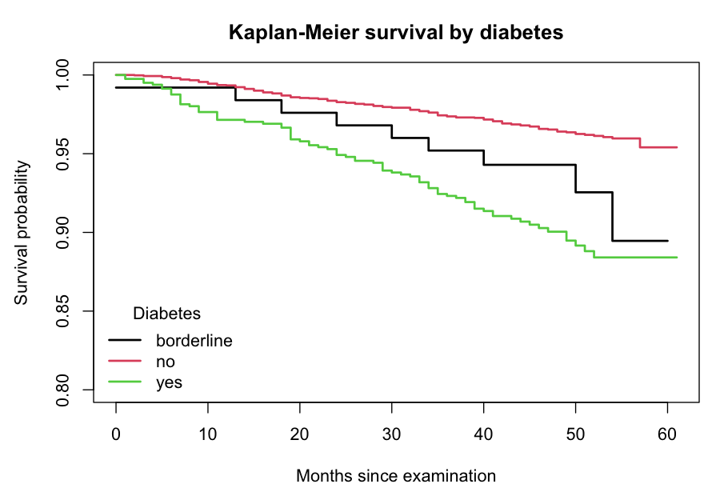

# Exploratory analysis

Generated by `R/03_eda.R` — regenerate with `make eda`. Seed 20260823, 2000 bootstrap replicates.

## Cohort

| Measure | Value |
| --- | --- |
| Participants | 5,459 |
| Deaths | 250 |
| Crude mortality | 4.58% |
| Person-months | 254,726 |
| Median follow-up (months) | 47 |
| Follow-up range (months) | 0–61 |
| Labelled for the 36-month endpoint | 5,450 |
| Deaths within 36 months | 187 |

## Categorical predictors versus mortality

Pearson chi-square on the predictor × death contingency table. `unknown` rows are excluded from each test and counted separately.

| Predictor | n | Unknown | Chi-square | df | Highest mortality | Lowest mortality | p (Holm) |
| --- | --- | --- | --- | --- | --- | --- | --- |
| sex | 5,459 | 0 | 26.4 | 1 | male (6.1%) | female (3.2%) | 1.93e-06 |
| race_eth | 5,459 | 0 | 44.9 | 5 | nh_white (6.9%) | nh_asian (1.7%) | 1.21e-07 |
| education | 5,456 | 3 | 33.6 | 4 | lt_9th (7.2%) | college_grad (2.1%) | 5.30e-06 |
| smoker | 5,449 | 10 | 77.4 | 2 | former (8.8%) | never (2.7%) | 1.83e-16 |
| diabetes | 5,456 | 3 | 68.2 | 2 | yes (10.0%) | no (3.5%) | 1.71e-14 |
| prior_chd | 5,435 | 24 | 103.8 | 1 | yes (18.6%) | no (3.9%) | 2.92e-23 |
| prior_cancer | 5,455 | 4 | 148.6 | 1 | yes (15.3%) | no (3.4%) | 4.83e-33 |

> **The smoking result is confounded by age.** Former smokers show higher crude mortality than current smokers, which inverts the expected ordering. People quit smoking as they age and as they become ill, so the `former` group is substantially older. Mean age by group:

| Smoking status | Mean age |
| --- | --- |
| current | 46.6 |
| former | 57.3 |
| never | 47.2 |
| unknown | 61.3 |

Adjusted models in `R/04_models.R` are what settle this; the crude table above should not be read as a causal effect of quitting.

## Continuous predictors versus mortality

Welch two-sample t-test (unequal variances), died minus survived. Complete cases per predictor.

| Predictor | Mean (survived) | Mean (died) | Difference | 95% CI | p (Holm) |
| --- | --- | --- | --- | --- | --- |
| age | 48.47 | 70.40 | +21.93 | [+20.41, +23.46] | 4.94e-86 |
| income_ratio | 2.45 | 1.80 | -0.65 | [-0.83, -0.47] | 1.44e-10 |
| bmi | 29.56 | 29.09 | -0.47 | [-1.32, +0.38] | 0.5465 |
| waist | 100.07 | 103.90 | +3.83 | [+1.70, +5.97] | 0.0015 |
| sbp | 124.92 | 137.06 | +12.13 | [+9.20, +15.06] | 1.59e-13 |
| dbp | 70.33 | 66.20 | -4.12 | [-5.79, -2.46] | 9.73e-06 |
| hdl | 54.23 | 54.25 | +0.02 | [-2.93, +2.97] | 0.9904 |
| hba1c | 5.83 | 6.22 | +0.39 | [+0.23, +0.55] | 1.25e-05 |

## Bootstrap confidence intervals

Percentile bootstrap, 2,000 replicates, on the difference in means between those who died and those who survived. The t-test above assumes approximate normality of the sampling distribution; this makes no such assumption.

| Predictor | Observed difference | Bootstrap SE | 95% CI (percentile) | Excludes zero |
| --- | --- | --- | --- | --- |
| age | +21.93 | 0.766 | [+20.41, +23.39] | yes |
| bmi | -0.47 | 0.422 | [-1.31, +0.34] | no |
| sbp | +12.13 | 1.499 | [+9.20, +15.11] | yes |
| hba1c | +0.39 | 0.080 | [+0.24, +0.56] | yes |

## Survival curves and log-rank tests

| Stratification | Groups | n | Observed deaths | Log-rank chi-square | p | Figure |
| --- | --- | --- | --- | --- | --- | --- |
| Smoking status | 3 | 5,449 | 249 | 78.0 | 1.18e-17 |  |
| Diabetes | 3 | 5,456 | 250 | 71.2 | 3.49e-16 |  |

## Caveats

- **Survey weights are not applied.** NHANES uses a complex multistage design; every figure here describes this sample, not the U.S. population.
- **Crude comparisons only.** Nothing above adjusts for age or any other covariate. See the smoking note.
- **Follow-up ends in 2019**, a median of 47 months after examination, which is why the binary endpoint is 36 months rather than 60.
